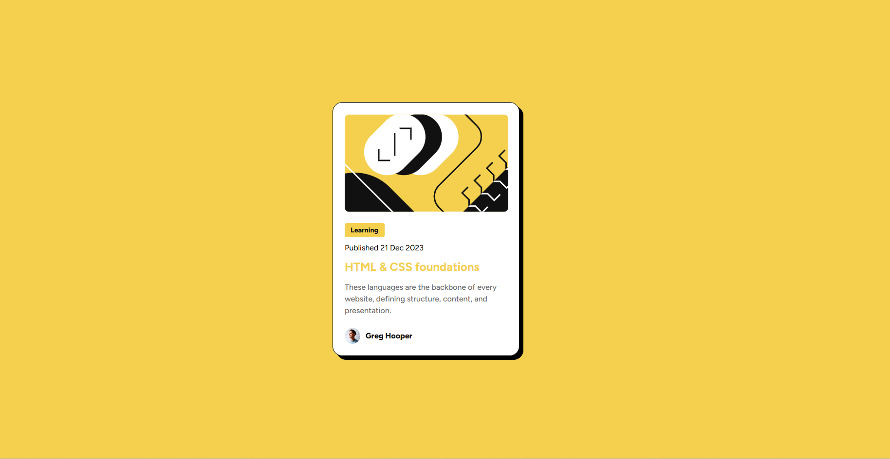

# Frontend Mentor - Social links profile solution

This is a solution to the [Social links profile challenge on Frontend Mentor](https://www.frontendmentor.io/challenges/social-links-profile-UG32l9m6dQ). Frontend Mentor challenges help you improve your coding skills by building realistic projects.

## Table of contents

- [Overview](#overview)
  - [The challenge](#the-challenge)
  - [Screenshot](#screenshot)
  - [Links](#links)
- [My process](#my-process)
  - [Built with](#built-with)
  - [What I learned](#what-i-learned)
  - [Continued development](#continued-development)
  - [Useful resources](#useful-resources)
- [Author](#author)
- [Acknowledgments](#acknowledgments)

## Overview

### The challenge

Users should be able to:

- See hover and focus states for all interactive elements on the page

### Screenshot

### Links

- Solution URL: [Solution URL here](https://github.com/nishanth1596/Frontend-Mentor-Challenges/tree/social-links-profile)
- Live Site URL: [Live site URL here](https://nishanth1596-social-links-profile.netlify.app/)

## My process

### Built with

- Semantic HTML5 markup
- CSS custom properties
- Flexbox
- Desktop-first workflow

### What I Learned

- I gained a clear understanding of when to use **margin** versus **padding** in CSS.
- I learned how **specificity** plays a crucial role in CSS and affects the application of styles.
- I also became more comfortable with coding and implementing styles in **HTML** and **CSS**.
- I also learned how to use **Figma** more efficiently.

### Continued development

I want to continue improving my understanding of layout techniques like Flexbox and CSS Grid to create more complex and responsive designs.

### Author

- Name: Nishanth
- Website - [My GitHub Profile](https://github.com/nishanth1596)
- Frontend Mentor - [@nishanth1596](https://www.frontendmentor.io/profile/nishanth1596)
- Twitter - [@nishanth1596](https://x.com/nishanth1596)

### Acknowledgments

A special thanks to the Frontend Mentor community for providing inspiration and feedback on this project. The resources provided by the platform were very helpful in getting me to the solution.
